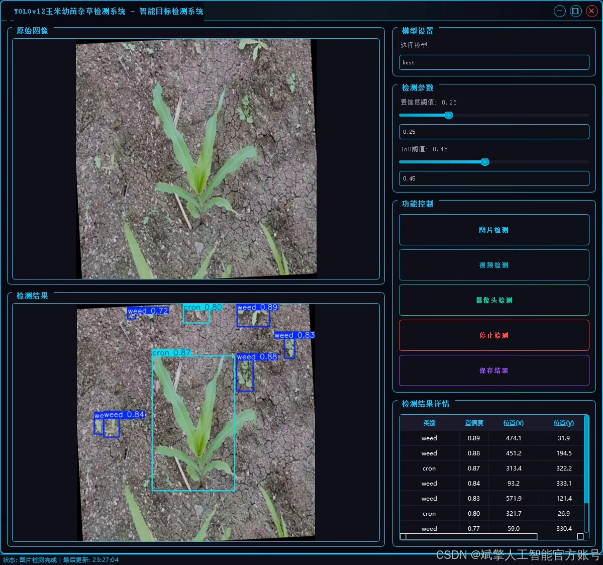
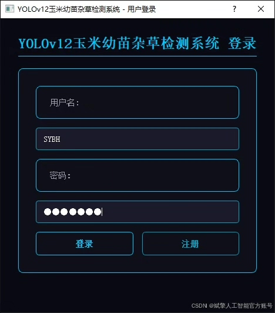
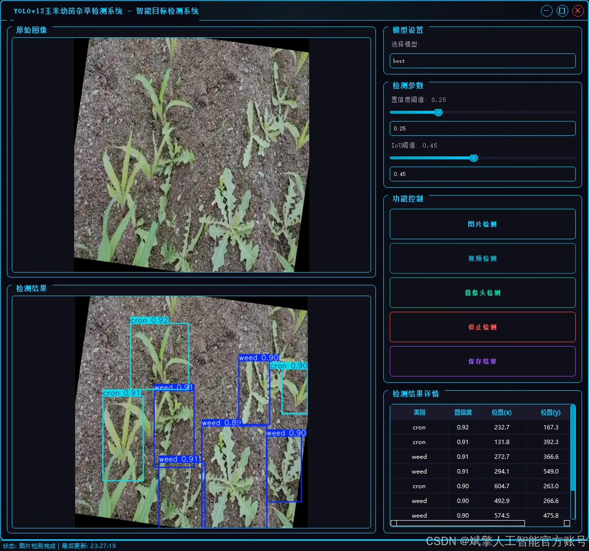
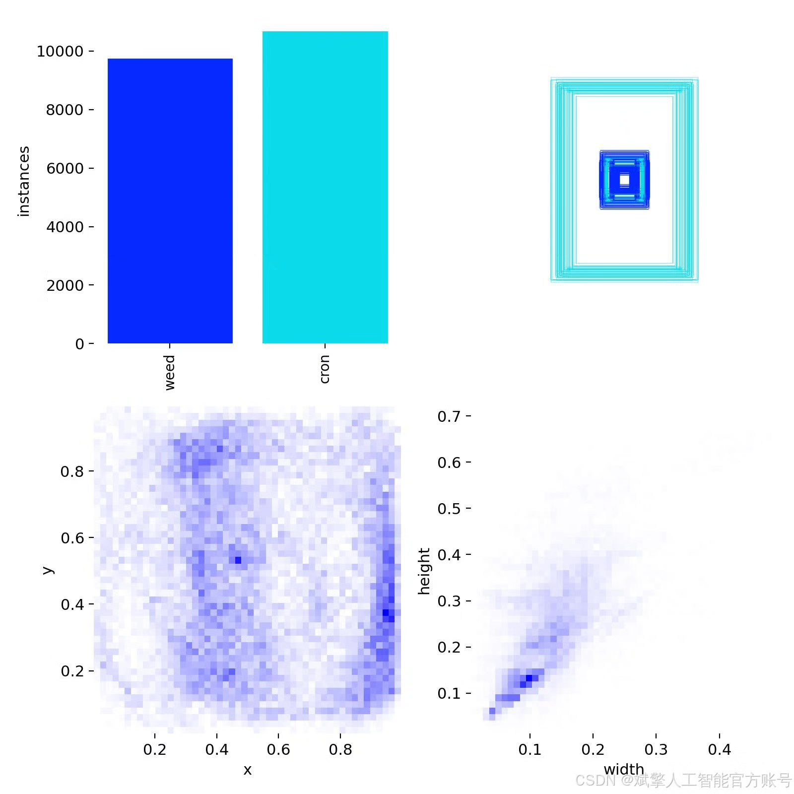
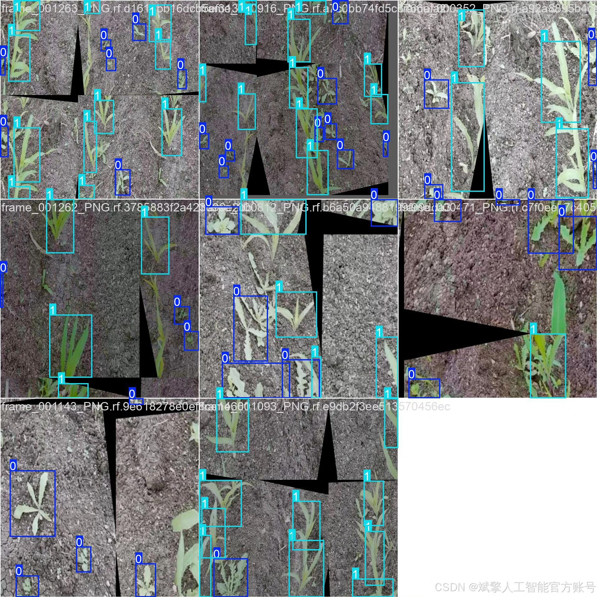
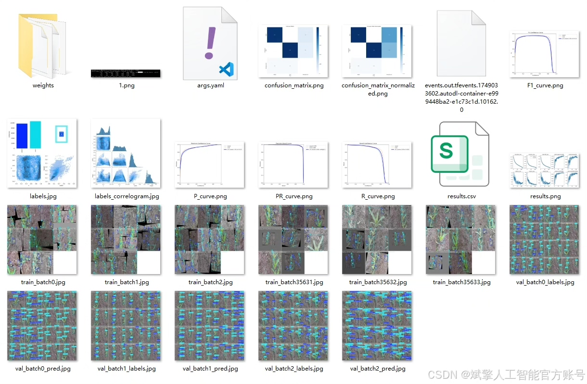
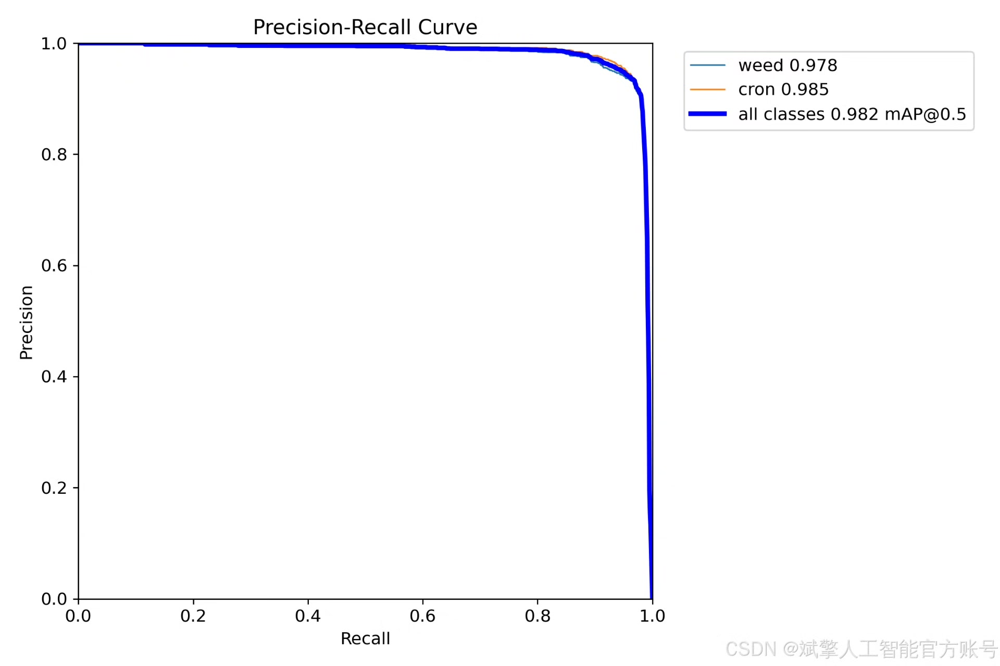
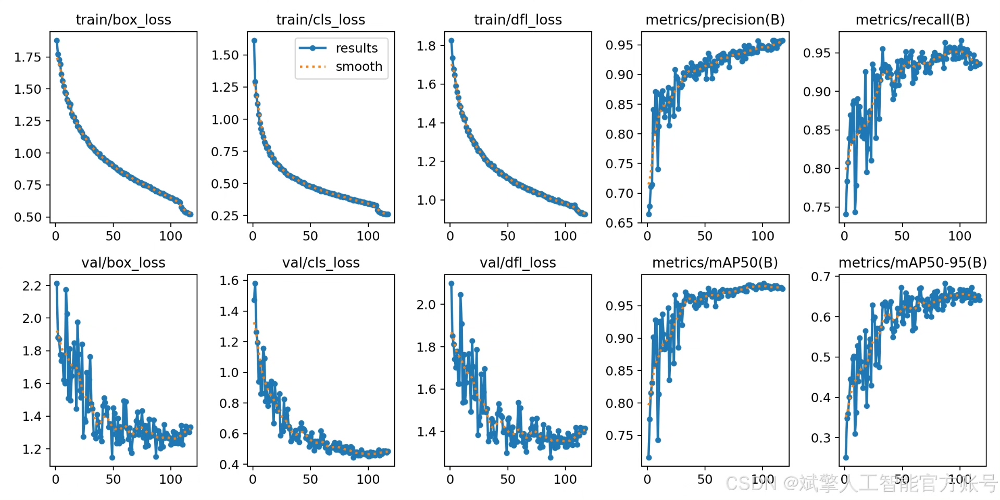
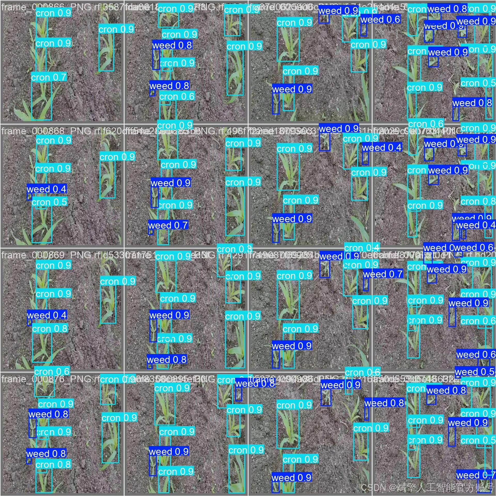

# YOLOv12 Corn Seedling Weed Identification System

## Body

YOLOv12 Corn Seedling Weed Detection System Based on Deep Learning YOLOv12: A Grain Crop Seedling and Weed Detection System (YOLOv12+YOLO dataset + UI interface + login registration interface + Python project source code + model)

This paper designs and implements a grain crop seedling and weed detection system based on deep learning YOLOv12. Targeting the precise weeding needs in agricultural scenarios, it achieves efficient object detection and classification. The system is centered around the YOLOv12 core algorithm, constructing a dataset containing two classes of targets ("weed" weed and "cron" corn seedling), with 2661 training images, 254 validation images, and 127 test images, ensuring the reliability and generalization capability of the model training. By integrating the Python development framework, the system integrates a user-friendly UI interface, supporting login registration functions, facilitating multi-user management and data security. The project provides complete source code, pre-trained models, and datasets, offering a practical and scalable solution for agricultural intelligent weeding, with high practical value and potential for promotion. Experiments show that the system can accurately identify crops and weeds in complex farmland environments, laying a technical foundation for subsequent automated weeding equipment.

✅ User Login Registration: Supports password verification and security validation.
✅ Three Detection Modes: Based on the YOLOv12 model, supports image, video, and real-time camera detection, accurately recognizing targets.
✅ Dual-Screen Comparison: Displays the original scene and detection results simultaneously on the screen.
✅ Data Visualization: Real-time table displays the category, confidence, and coordinates of detected targets.
✅ Intelligent Parameter Tuning: Offers a confidence slide bar to dynamically optimize detection accuracy, adapting to different scene requirements.
✅ Sci-Fi Interactive Interface: Dark theme paired with dynamic light effects, reducing visual fatigue and enhancing operational experience.

## Images

## Payment

Here is a pay link on Stripe ( https://buy.stripe.com/3cs8yP7sY87d0vu9AB ). Please contact me lonlonago@foxmail.com after funding $89, and I will send you a complete data files , thank you!

